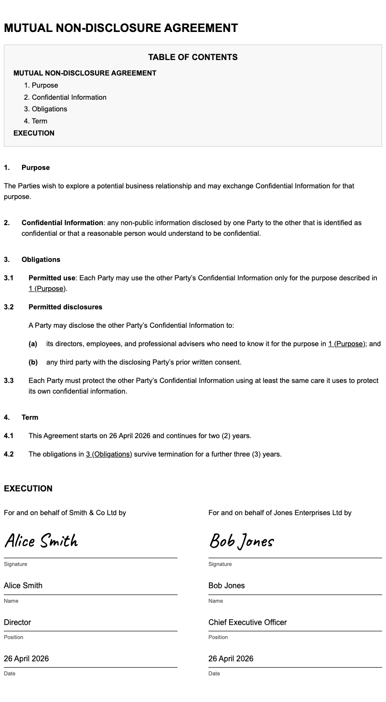

# Legal Contract Template

A lightweight template for authoring legal documents in Markdown and rendering them as self-contained HTML.

Built on [Quarto](https://quarto.org), with a custom Pandoc Lua filter that applies standard legal numbering conventions and a minimal stylesheet suited for printing or digital distribution.

## Example Output



View the rendered artefacts from the included example: [HTML](https://github.com/blissful-living/legal-contract-template/blob/main/examples/agreement.html) | [PDF](https://github.com/blissful-living/legal-contract-template/blob/main/examples/agreement.pdf)

## Getting Started

### Quick Start

#### 1. Clone the repository

```bash
git clone https://github.com/blissful-living/legal-contract-template.git
cd legal-contract-template
```

#### 2. Install Quarto

**macOS:**

```bash
brew install quarto
```

**Linux:** Download and install the package for your distribution from the [Quarto get started page](https://quarto.org/docs/get-started/). Quarto 1.4 or later is required.

#### 3. Compile the example

```bash
./compile.sh examples/agreement.qmd
```

Open `examples/agreement.html` in your browser. You will see a fully rendered legal agreement with hierarchical clause numbering, a table of contents, and an execution block.

To also produce a PDF (requires Google Chrome or Chromium):

```bash
./compile.sh examples/agreement.qmd --pdf
```

### Creating Your Own Document

Copy the included example to a new file:

```bash
cp examples/agreement.qmd nda.qmd
```

Then open `nda.qmd` and:

1. Update `title`, `parties`, and `execution` in the YAML front matter (see [Document Front Matter](#document-front-matter) below).
2. Write the body using standard Markdown headings (`#`, `##`, `###`, `####`, `#####`). See [Heading Levels](#heading-levels) for how each level maps to legal numbering.
3. Compile:

```bash
./compile.sh nda.qmd
```

### Converting a Word or Google Docs Contract

If you have an existing agreement in Microsoft Word or Google Docs, you can convert it into a `.qmd` file using the included AI prompt.

#### Step 1: Export to Markdown

**From Google Docs:** Use the built-in Markdown export: File → Download → Markdown (.md). This gives you a `.md` file ready for the next step.

**From Microsoft Word:** Word has no native Markdown export, so use [Pandoc](https://pandoc.org) to convert the `.docx` file:

```bash
pandoc -f docx -t markdown -o contract.md contract.docx
```

This also works if you prefer to download your Google Doc as a Word file first (File → Download → Microsoft Word (.docx)) and convert it that way.

#### Step 2: Run the AI conversion prompt

The repository includes `prompts/md2qmd.md`, an AI instruction file that converts a Markdown legal document into a properly structured `.qmd` file. It handles heading level mapping, normalisation of inconsistent numbering across parts, and cross-reference conversion.

This has been tested with [Claude Code](https://claude.ai/code) and may work with other AI coding agents.

Open a Claude Code session in the repository directory and send the following message (substituting your actual source file path):

```
Read prompts/md2qmd.md and follow its protocol exactly.

Source file: contract.md

You MUST not open or read the source file until md2qmd.md instructs you to.
```

The output file is created automatically with the same base name and a `.qmd` extension.

#### Step 3: Review and compile

Review the generated `.qmd` file, adjust the front matter (parties, dates, signatories), and compile:

```bash
./compile.sh contract.qmd
```

## Reference

### Features

- Legal-style hierarchical numbering: `1.` → `1.1` → `(a)` → `(i)`
- Cross-references between clauses, with the referenced heading's title appended automatically (e.g. *"as defined in clause 1.1 (Purpose and Objectives)"*); opt-out per document via `ref-titles: false`
- Auto-generated table of contents (configurable depth, off by default at depth 0)
- Auto-generated heading IDs (no manual `{#sec-*}` markup needed; add friendly names only where you want stable references)
- Multi-part documents and schedules (`#` headings reset all numbering for each part)
- Document variables (parties, dates, signatories) defined in the QMD front matter, with optional split into a sibling `parameters.yaml` for template reuse across many instances (see [Template Reuse](#template-reuse))
- Multi-file documents via Quarto's `` shortcode — keep a generic contract scaffold in one file and per-instance prose (scope, schedules) in another
- Execution/signature block auto-generated from YAML, with optional handwriting-style auto-signature
- Supports any number of signatories; B2B, B2P, and P2P layouts determined automatically
- Self-contained HTML output (a single file with no external dependencies)
- Configurable hyperlink colour (defaults to body text colour)
- One-command PDF export via headless Chrome (`--pdf` flag)
- Print-ready styling (Arial, 11pt, 800 px body width)

### Repository Structure

```
.
├── _quarto.yml          # Quarto project configuration
├── compile.sh           # Build script: link cross-refs + quarto render
├── assets/
│   ├── caveat.woff2         # Handwriting font used for auto-sign signatures
│   ├── legal-numbering.lua  # Pandoc Lua filter for legal section numbering
│   └── style.css            # Print-oriented stylesheet
├── examples/
│   ├── agreement.html       # Rendered example output
│   ├── agreement.pdf        # Rendered example PDF
│   ├── agreement.qmd        # Simple example document (two parties, no schedules)
│   └── example.png          # Screenshot of rendered output
├── prompts/
│   └── md2qmd.md            # AI instruction file for converting .md contracts to .qmd
└── scripts/
    ├── link-refs.py         # Cross-reference linker (called by compile.sh)
    └── verify-counts.py     # Post-conversion completeness checker
```

### Document Front Matter

Document-level configuration lives in the YAML front matter of the `.qmd` file. For reusable templates, per-document values can optionally be split into a sibling `parameters.yaml` — see [Template Reuse](#template-reuse).

```yaml
---
title: "General Business Agreement"
toc-max-depth: 2
parties:
  person_1: "Alice Smith"
  person_2: "Bob Jones"
  signed-date: "26 April 2026"
execution:
  # title: "EXECUTION"
  # intro: "Executed by the undersigned."
  signatories:
    - name: "Alice Smith"
      organisation: "Smith & Co Ltd"
      role: "Director"
      date: "2026-04-26"
      auto-sign: true
    - name: "Bob Jones"
      organisation: "Jones Enterprises Ltd"
      role: "Chief Executive Officer"
      date: "2026-04-26"
      auto-sign: true
---
```

The values can be referenced anywhere in the document body with ``. For example:

```markdown
This Agreement is entered into as of  between
**** and ****.
```

### Template Reuse

For documents you expect to instantiate many times (services agreements, NDAs, retainer letters across multiple engagements), the qmd can be kept as a generic template, with per-instance values and bespoke sections in sibling files.

#### External Parameters File

Per-document variables (parties, dates, fees, signatories) can be moved out of the qmd frontmatter into a sibling `parameters.yaml`. `compile.sh` auto-detects `parameters.yaml` (or `parameters.yml`) next to the input file and passes it to Quarto as a metadata source.

```yaml
# parameters.yaml — no `---` fences
parties:
  provider:
    name: "Acme Consulting Limited"
    address: "1 Innovation Way, Wellington 6011, New Zealand"
  client:
    name: "Globex Corporation"
    address: "200 Market Street, Auckland 1010, New Zealand"

execution:
  agreement-date: "1 March 2026"
  signatories:
    - name: "Alice Smith"
      organisation: "Acme Consulting Limited"
      role: "Director"
      auto-sign: true
    - name: "Bob Jones"
      organisation: "Globex Corporation"
      role: "Chief Executive Officer"
      auto-sign: false
```

The template's qmd frontmatter then keeps only document-level keys:

```yaml
---
title: "Master Services Agreement"
toc-max-depth: 2
---
```

**Precedence**: when a key is defined in *both* the qmd frontmatter and `parameters.yaml`, the **qmd frontmatter wins**. This follows Pandoc's standard rule (document metadata overrides `--metadata-file` sources) and gives you a deliberate override hook — put shared defaults in `parameters.yaml`, override per-document from the qmd when needed.

**When `parameters.yaml` is absent**: `compile.sh` behaves as before. All variables must then live in the qmd frontmatter. The two patterns are interchangeable — start with everything in the qmd, extract `parameters.yaml` once template reuse becomes worthwhile.

#### Including External Files

Quarto's `` shortcode inlines another file at the include point, before Lua filters run. This is useful for keeping a generic contract scaffold separate from per-instance prose (e.g., a Scope of Services schedule that changes per engagement):

```markdown
# Schedule 2: Scope of Services {#sec-scope}


```

The path is resolved relative to the parent qmd's directory. The included file is a body fragment — no YAML frontmatter, just headings and paragraphs. Heading levels continue the parent's hierarchy: use `##`, `###`, etc., as if the content were written inline.

Cross-references (`@sec-…`), TOC entries, and section numbering all work transparently across the file boundary, since the include happens before any Lua processing.

#### Putting It Together

A common template-reuse layout combines both mechanisms — a single template lives once, each engagement is a folder with its own parameters and scope:

```
master-services-agreement/
├── msa.qmd                # template — clauses, schedules, 
├── parameters.yaml        # variables for this instance
└── scope.qmd              # bespoke scope prose for this instance
```

Compile:

```bash
./compile.sh master-services-agreement/msa.qmd
```

For a second engagement, copy the folder, edit `parameters.yaml` and `scope.qmd`, leave `msa.qmd` untouched. The same template generates both contracts.

### Heading Levels

Each Markdown heading level maps to a named position in the legal numbering hierarchy:

| Heading | Name | Renders as |
|---------|------|------------|
| `#` | **Part** | Title only (resets all numbering counters; use for the document title and each schedule) |
| `##` | **Clause** | `1.` `2.` `3.` |
| `###` | **Sub-clause** | `1.1` `1.2` `1.3` |
| `####` | **Item** | `(a)` `(b)` `(c)` |
| `#####` | **Sub-item** | `(i)` `(ii)` `(iii)` |

#### Clause Formatting

A clause (`##`) supports three valid forms:

**Variant A — title only** (sub-clauses follow):
```markdown
## Acceptance notices

### Each acceptance notice must state…
```

**Variant B — title with body paragraph** (no sub-clauses; body text on the next line):
```markdown
## Pre-emptive rights

Subject to paragraphs 2 and 8, all Securities proposed to be issued…
```

**Variant C — bold label with body text on the heading line:**
```markdown
## **Committees**: A committee of directors must, in the exercise of the powers…
```

For Variant C, the Lua filter extracts only the bold label portion for the table of contents, so `## **Committees**: A committee of directors must…` appears as "Committees" in the TOC.

#### Sub-clause Formatting

When a sub-clause has a bold label followed directly by its body text and no further items, include both inline in the `###` heading:

```markdown
### **Governing law:** This agreement is governed by the laws of New Zealand.
```

When a sub-clause has items below it, use the heading for the label only and let the items follow as `####` headings:

```markdown
### Notices

A notice given under this agreement must:

#### be in writing; and

#### be delivered by hand, email, or prepaid post to the address set out in Schedule 1.
```

### Multi-part Documents and Schedules

The `#` heading acts as a part boundary: it resets all numbering counters and appears in the table of contents as a top-level entry. This makes it suitable for documents that consist of a main body plus one or more schedules.

```markdown
# Shareholders Agreement

## Interpretation
...

## Share transfers
...

# Schedule 1: Pre-emptive rights

## Pre-emptive rights on transfer
...
```

After the `# Schedule 1: Pre-emptive rights` heading, numbering restarts from `1.`. Each schedule is self-contained.

Give each `#` heading a manual ID when you need to link to it from the document body:

```markdown
# Schedule 1: Pre-emptive rights {#sec-sched-1}
```

Then reference it with a plain Markdown link: `[Schedule 1](#sec-sched-1)`.

### Table of Contents

The Lua filter generates a navigation block at the top of the rendered document. Two metadata keys control its appearance.

#### TOC Depth

The `toc-max-depth` key controls which heading levels are included.

| Value | Meaning |
|-------|---------|
| `0` | No TOC (disabled) |
| `1` | Title headings only (`#`) |
| `2` | Title + section headings (`#`, `##`) — **default** |
| `3` or more | Deeper levels (`###`, `####`, …) |
| `"##"` | Hash notation — equivalent to the matching numeric depth |

**Set depth in the document's YAML front matter:**

```yaml
---
title: "My Agreement"
toc-max-depth: 3
---
```

**Override on the command line** without editing the file:

```bash
# Include headings up to ### in the TOC
quarto render examples/agreement.qmd -M toc-max-depth:3

# Suppress the TOC entirely
quarto render examples/agreement.qmd -M toc-max-depth:0
```

#### TOC Heading

The navigation block heading defaults to `Contents`. Override it with `toc-title`:

```yaml
---
title: "My Agreement"
toc-title: "TABLE OF CONTENTS"
---
```

This is also set project-wide in `_quarto.yml` and can be overridden per document.

### Link Colour

By default, hyperlinks (cross-references, TOC entries, and any inline links) use the body text colour (`black`). Set `link-color` in the document's front matter to override:

```yaml
---
title: "My Agreement"
link-color: "#0000EE"   # browser-standard blue
---
```

Any valid CSS colour value is accepted — named colours (`navy`, `darkblue`), hex codes, or `rgb(…)` / `hsl(…)` notation. The override applies uniformly to all links in the document, including TOC entries.

To revert to the default, remove the key or leave it commented out (as shown in the example document).

### Execution Block

The execution (signature) section is auto-generated from the `execution` key in the front matter. If the key is absent or `signatories` is empty, no section is appended.

The optional `intro` field renders a preamble sentence between the heading and the signatory blocks. If omitted, no preamble is shown (the `EXECUTION` heading alone is sufficient). When supplying intro text, avoid relying on terms that may not be defined in every contract (e.g. *"the Parties"*, *"this Agreement"*). A safe, self-contained alternative is *"Executed by the undersigned."*

#### Signatory Fields

| Field | Required | Description |
|-------|----------|-------------|
| `name` | Yes | Full name of the signatory |
| `organisation` | No | Legal entity name (presence signals a B2B/org signatory) |
| `role` | No | Position or title within the organisation |
| `date` | No | Signing date; ISO 8601 (`YYYY-MM-DD`) is reformatted to long form |
| `auto-sign` | No | Render the name in handwriting font above the signature line |

When `organisation` is present, the block header reads *"For and on behalf of [Org] by"*. When absent, the signatory block is rendered without an entity header (personal signatory).

#### Section Title

The heading defaults to `EXECUTION`, which is standard in Australian, New Zealand, and UK commercial agreements. To use a different title (e.g. for US-style documents):

```yaml
execution:
  title: "SIGNATURE PAGE"
  signatories: [...]
```

#### Multiple Signatories

Any number of signatories is supported. They are laid out in a two-column grid that wraps automatically for three or more parties.

### Cross-references

The Lua filter assigns a positional ID to every heading automatically. For example, the second sub-clause of section 3 gets `id="sec-3-2"`, and you can reference it anywhere in the document:

```markdown
See @sec-3-2 for the payment terms.
```

The filter replaces `@sec-3-2` with a hyperlink such as *clause 3.2 (Payment Terms)* — see [Reference Titles](#reference-titles) below for how the parenthetical title is sourced.

#### Friendly IDs

You can also assign a human-readable ID to any heading:

```markdown
## Payment Terms {#sec-payment}
```

Both the friendly ID and the positional ID work as cross-reference targets:

```markdown
See @sec-payment.   <!-- resolves to "clause 3.2 (Payment Terms)", links to #sec-payment -->
See @sec-3-2.       <!-- same result -->
```

Friendly IDs are stable: if you insert a clause earlier in the document and `Payment Terms` moves from `3.2` to `4.1`, `@sec-payment` still resolves correctly and displays the updated number *clause 4.1 (Payment Terms)*. Positional references like `@sec-3-2` would need to be updated manually.

#### Reference Titles

By default, a cross-reference whose display text is just the clause number has the heading's title appended in parentheses. So *"governed by clause 1.1"* renders as *"governed by clause [1.1 (Purpose and Objectives)](#sec-purpose)"*, giving the reader an anchor without needing to follow the link.

The title is derived from the referenced heading's content using three rules, applied in order:

1. **Bold-prefixed headings** — when a heading starts with a bold span, the bold text is the title (a trailing `:` is stripped). This covers both `## **Title**` (bold-only) and `## **Title**: body…` (bold + colon + body). The `:` may sit inside or outside the bold span.
2. **Plain-text headings ending in `.` `!` `?` `:` or `;`** — treated as body-as-heading clauses with no title. References to them render as the number only. Use this when the heading sentence *is* the clause:
   ```markdown
   ### This Agreement may be executed in any number of counterparts, including by electronic signature…
   ```
3. **Plain-text headings without terminal punctuation** — the entire heading text is the title (e.g. `## Purpose and Objectives` → title "Purpose and Objectives").

Existing markdown links with custom display text (e.g. `[the payment terms](#sec-payment)`) are left alone — only links whose text matches the clause number are augmented.

To disable title appending document-wide, set `ref-titles: false` in the YAML front matter:

```yaml
---
title: "My Agreement"
ref-titles: false
---
```

#### Plain-text Cross-references — `link-refs.py`

Lawyers tend to write cross-references as prose ("clause 5.8", "paragraphs 2 and 8") rather than `@sec-*` tokens. `link-refs.py` rewrites those into Markdown links pointing at the correct heading anchor. It understands chained references ("clauses 5.13 to 5.16"), schedule-scoped paragraph references ("paragraph 3 of Schedule 2"), and connector words ("clause", "clauses", "paragraph", "paragraphs", "Schedule", "Schedules"). See the script's header comment for the full matching rules.

Use `compile.sh` to run the linker and `quarto render` together (there is rarely a reason to invoke `link-refs.py` directly).

##### Numbering Normalisation in Multi-part Documents

Complex legal documents (a Master Services Agreement with attached schedules, a Company Constitution with a main body and several operative schedules) are often drafted in sections, sometimes by different people at different times. The result is frequently inconsistent numbering conventions across parts: the main body numbers sub-items as `(a)`, `(b)`, `(c)`, one schedule uses `1.`, `1.1`, `(a)`, and another uses a flat numbered list throughout. Cross-references written in the text reflect those original conventions ("paragraph 4c" meaning sub-item (c) of paragraph 4 in a given schedule, for example).

When `md2qmd.md` converts such a document, it normalises all parts to a single consistent heading hierarchy. The Lua filter then numbers every item positionally within that hierarchy (what was labelled `(c)` in the source becomes the third item at that level, rendered as `(iii)` or `4.3` depending on depth). A cross-reference like "paragraph 4c" now resolves to the heading the document renders as `4.3`.

The linker handles this correctly: it converts the letter suffix to its ordinal position when building the link target, so "paragraph 4c" generates a link pointing to the right heading. However, the display text of that link still reads "4c" while the rendered document numbers the heading `4.3`, which is inconsistent for a reader.

To catch these cases, the linker reports them after each run:

```
NOTE: stale letter-suffix references found (link targets are correct
but display text uses the old notation):
  line 42: "4c" → document now numbers this "4.3" — consider updating the source
  line 58: "5b" → document now numbers this "5.2" — consider updating the source
  Run with --fix-refs to rewrite these automatically.
```

The note is informational: the links work and point to the right clauses. What is stale is only the visible text. There are two ways to resolve it:

- **Update the source document** — change "paragraph 4c" to "paragraph 4.3" in the original `.md` before re-running the converter. This keeps the source and the rendered output consistent.
- **Accept the fix automatically** — run the compile script with `--fix-refs` to rewrite the display text in the `.qmd` directly:

```bash
./compile.sh --fix-refs examples/agreement.qmd
```

This changes `[4c](#sec-…-4-3)` to `[4.3](#sec-…-4-3)` in place. The flag can be passed on any subsequent compile run; if there are no stale references, it has no effect.

### Rendering

#### HTML

Use `compile.sh` to link cross-references and render in one step:

```bash
./compile.sh examples/agreement.qmd
```

This produces `agreement.html` (a self-contained file that can be opened in any browser, emailed, or printed). Pass `-o other-name.html` to override the output path.

`compile.sh` runs `link-refs.py` first (rewriting plain-text cross-references like *clause 5.8* into `@sec-*` tokens) and then `quarto render`. Calling `quarto render` directly skips the linker, so cross-references in your prose will not become hyperlinks.

#### PDF

Pass `--pdf` to produce a PDF alongside the HTML in one step:

```bash
./compile.sh examples/agreement.qmd --pdf
```

This renders `agreement.html` as usual and then converts it to `agreement.pdf` using headless Chrome. The PDF is rendered by the same engine as Chrome's Print → Save as PDF, so the output is identical to what you see in the print preview.

`--pdf` can be combined with `-o`:

```bash
./compile.sh examples/agreement.qmd -o examples/agreement.html --pdf
# produces examples/agreement.html and examples/agreement.pdf
```

#### Overwrite protection

By default, `compile.sh` checks whether the output file(s) already exist and prompts for confirmation before overwriting. Pass `--force` (or `-f`) to skip the prompt:

```bash
./compile.sh examples/agreement.qmd --force
./compile.sh examples/agreement.qmd --pdf -f
```

The check covers both the HTML and PDF outputs. In non-interactive contexts (piped input, CI), the script aborts rather than silently overwriting — use `--force` to allow it.

**Chrome detection** — the script tries the following in order and uses the first match:

| Platform | Locations checked |
|----------|-------------------|
| macOS | `/Applications/Google Chrome.app/…`, `/Applications/Chromium.app/…` |
| Linux | `google-chrome`, `google-chrome-stable`, `chromium-browser`, `chromium` |

To use a different binary, set the `CHROME` environment variable:

```bash
CHROME=/usr/bin/chromium-browser ./compile.sh examples/agreement.qmd --pdf
```

## Licence

Apache 2.0 — see [LICENSE](LICENSE).
Copyright &copy; 2026 [Blissful Living Foundation](https://labs.blissful.im).
